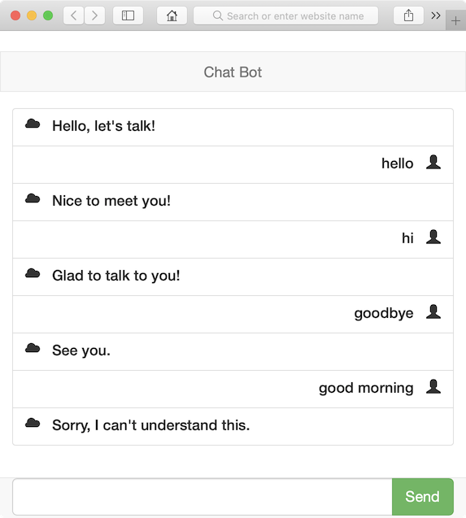

# Chat Bot

## Requirements
* Python 3

## Packages
* bottle

## Run server
```
python server.py
```

## Front-end
```
http://127.0.0.1:8080/
```

## Front-end framework
* Bootstrap
* jquery
* vue

## Screenshot

